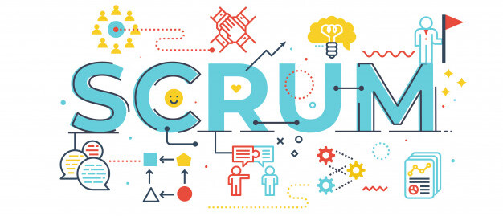

# SCRUM notes

## Ágil / Bases de SCRUM

* Construccion de un producto
  * ¿Qué construir?
  * ¿Comó construirlo?
  * Salir a tiempo

Palabras claves: _experiencia_, _solucionar_, _problemas_, _cambio_, _preguntar_, _lograr_, _retroalimentación_, _resolver_, _evaluación_, _iteración_, _recopilación_, _datos_, _empirico_, _corregir_, _kaisen_, _planificación_.

* 1986 primera mención de SCRUM
* equipos autoorganizados
* el nombre provienen de una formación de rubgy
* espada larga -> objetivo a largo plazo
* espada corta -> objetivo día a día
* publicación oficial de SCRUM en 2010
* mentologia kaisen, "mejoras continua"
* transparencia, inspección y adaptación
* SCRUM toma ideas de la metologia de LEAN, "minimizando el desperdicio"
* tiempo ideal / tiempo real -> mejoras de procesos en base a datos proporcionados

## ¿Qué y comó llegar a ser ÁGIL?

4 Principales Valores de Agíl

1. Procesos y herramientas, aspectos fundamentales, buena comunicación y colaboración entre los individuos.
2. Software (producto) funcionamiento sobre documentación extensiva, SCRUM se utiliza en proyectos muy grandes y complejos, y en equipos multidisciplinarios.
3. Colaboración con el cliente vs. negociación contractual, comunicación constante con el cliente sin ser tan riguroso con los requerimientos, ser prudente con los cambios.
4. Respuesta al cambio y seguir un plan, ¿WTF?, la adaptabilidad define el exito del producto.

[link_12_principios_agiles](https://www.scrumnetwork.com/principios)

## Equipo de SCRUM

* Pequeño grupo de profesionales (no mayor a 10 personas).
* Accountability, persona que toma la resposabilidad.

3 roles de SCRUM

1. Product Owner, persona encargada de definir que construir, a cargo de entregar pequeñas entregas, tomando retroalimentacion constante.
2. Scrum Master, encargado de salir a tiempo, implementar SCRUM tal y como esta escrito en la guia, ayudando todo el tiempo en mejoras y apoyando al Product Owner con ciertas tecnicas de falicitación.
3. Developer, persona que ayuda a construir el producto, no existe jerarquias en el equipo.

Una __recomendación__, 8 personas como máximo ocupando el rol de developer, cada persona del equipo debe de asumir de buena manera su rol. Multifuncional y autogestionable, habilidades necesarias para construir el producto.

## Eventos de SCRUM

Pilares fundamentales del SCRUM __Transparencia__, __Inspeccionar__, __Adaptar__.

* Spring planning, initiates the Sprint by laying out the work to be performed for the Sprint. This resulting plan is created by the collaborative work of the entire Scrum Team.
* Daily Scrum,  is a 15-minute event for the Developers of the Scrum Team. To reduce complexity, it is held at the same time and place every working day of the Sprint.
* Sprint Review, a sprint review is an informal meeting held at the end of a sprint, during which the team shows what was accomplished, while the stakeholders provide feedback. It's a collaborative working session rather than a one-sided presentation.
* Sprint Retrospective, is a recurring meeting held at the end of a sprint used to discuss what went well during the previous sprint cycle and what can be improved for the next sprint.
* Sprint, una iteración, dura entre 4 semanas a 2 semanas, a veces menos.

## Valores de Scrum

El objetivo es tener equipos hiper-productivos.

4 valores fundamentales.

* Respeto, equipos psicologicamente seguros.
* Coraje, estrechamente relacionado con el Respeto, buena comunicación, pedir ayuda y opinar.
* Compromiso, contar con nuestros compañeros y realizar las tareas.
* Apertura, ser abiertos y transparentes, dar opiniones.
* Foco, divide y venceras, cada grupo se enfocara en resolver un problema especifico.

## Artefactos

Existen __3 artefactos__.

* Product Backlog, caracteristicas de un ser vivo, en constante cambio, lista de requerimientos, los primeros items son los requerimientos que saldran primero y los cuales saldran al usuario final, y los ultimos items seran los ultimos en salir. Todo el tiempo ser irán refinando el producto. Y se conforma de product backlog items. Se dice que este es el compromiso del producto que es el objetivo del producto.
* Spring Backlog, el plan inicial de como se construira el incremento. Que también es un compromiso.
* Definition of done, checklist en el que pasan todos los items, el producto antes de salir debe de cumplir cierto estandares de calidad segun la empresa en la que se trabaje.*
* Increment, lo que los desarrolladores lograron llevar al terminado, solo saldra lo que definitivamente este terminado aunque no se hayan cumplido con todos los compromisos.

## 3 - 5 - 3

Ciclo de vida de SCRUM

* Product Backlog
  * Sprint Planning
    * Spring Backlog
      * Daily Scrum
  * _Product Backlog Refinement_
  * Sprint Review
  * Sprint Retrospective
* Increment

_Daily Scrum_, no es un reporte de status.

_Product Backlog Refinement_, adelantarse al siguiente spring para refinar el Product Backlog.

Se aplica SCRUM o no se aplica SCRUM, la metodología fue creada por un razón.

## Guia SCRUM

[guia_scrum](https://scrumguides.org/)

## Certificación SCRUM essentials

[link](https://www.credential.net/f4736b93-439d-444c-aa36-ea823003792b)
