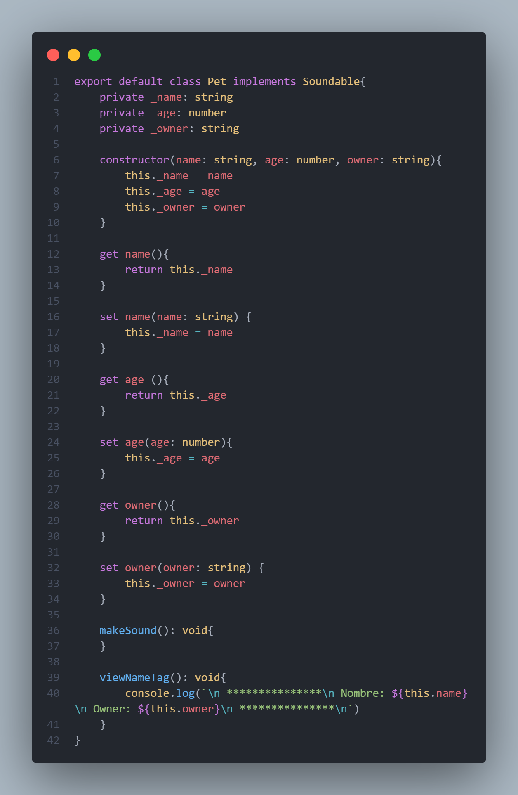
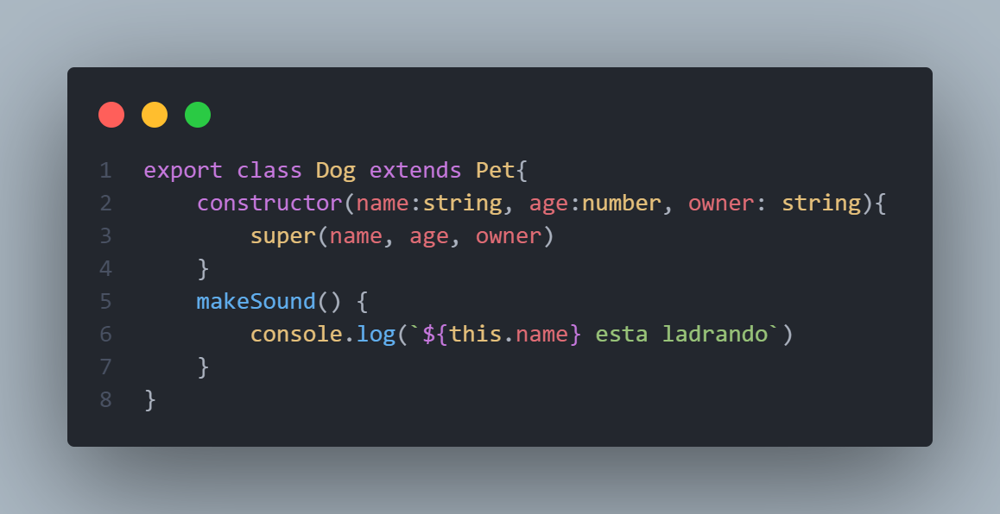
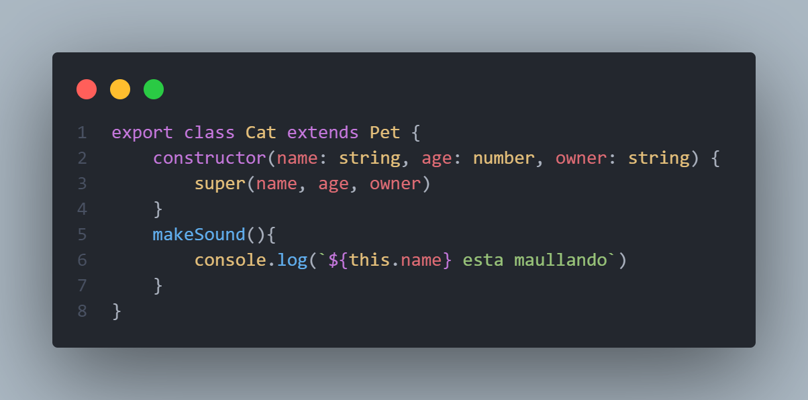
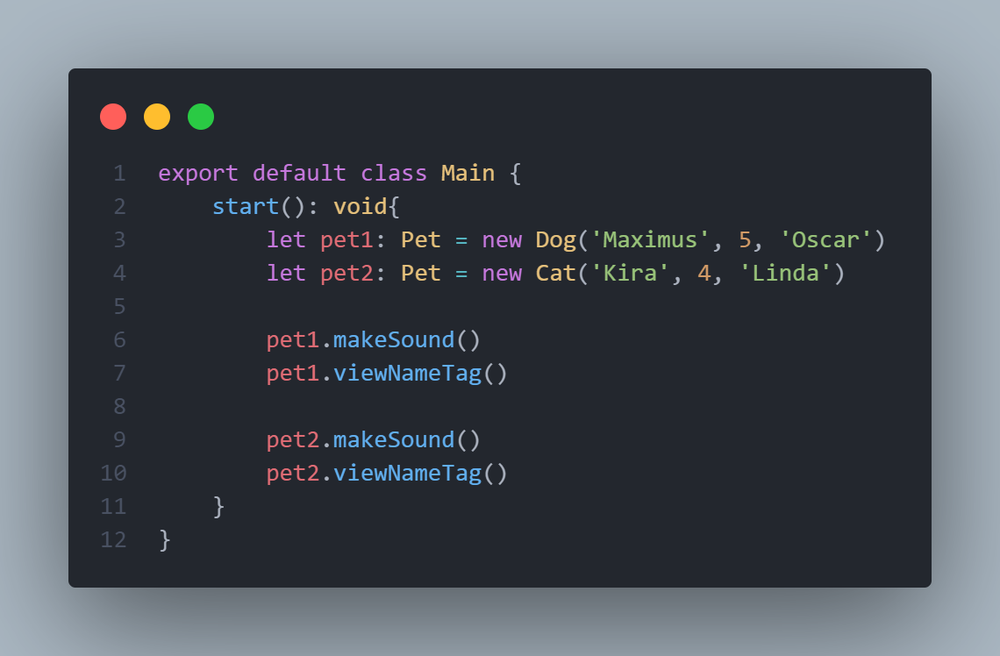
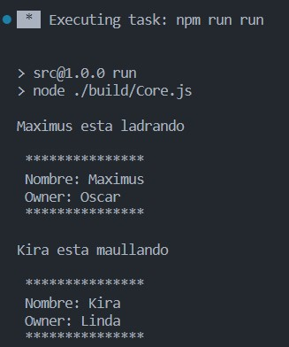

# OOP Glossary

## What's Abstraction?

Las características especificas de un objeto, aquellas que lo distinguen de los demás 
tipos de objetos y que logran definir límites conceptuales respecto a quien está haciendo 
dicha abstracción del objeto.

[link](https://styde.net/abstraccion-programacion-orientada-a-objetos/)

## What's Inheritance

Es el mecanismo por el cual una clase permite heredar las características (atributos y métodos)
 de otra clase.

[link](https://ifgeekthen.nttdata.com/es/herencia-en-programacion-orientada-objetos)

## What's Polymorphism

Es una relajación del sistema de tipos, de tal manera que una referencia a una clase 
(atributo, parámetro o declaración local o elemento de un vector) acepta direcciones de 
objetos de dicha clase y de sus clases derivadas (hijas, nietas, ...).

[link](https://desarrolloweb.com/articulos/polimorfismo-programacion-orientada-objetos-concepto.html)

## What's Encapsulation

Es el proceso de almacenar en una misma sección los elementos de una abstracción que constituyen 
su estructura y su comportamiento; sirve para separar el interfaz contractual de una abstracción 
y su implementación. Por lo tanto, la encapsulación garantiza la integridad de los datos que 
contiene un objeto.

[link](https://styde.net/encapsulamiento-en-la-programacion-orientada-a-objetos/)

## What's a Class

Una clase es una especie de plantilla que nos servirá para crear objetos de forma ya predefinida

[link](https://www.kikopalomares.com/blog/que-es-una-clase-en-programacion)

## What's an Object

Es una unidad dentro de un programa informático que tiene un estado, y un comportamiento. 
Es decir, tiene una serie de datos almacenados y tareas que realiza con esos datos en el tiempo de ejecución. 
Los objetos se puede crear instanciando clases.

[link](https://www.kikopalomares.com/blog/que-es-un-objeto-en-programacion)

## What's an Instance

Un objeto con un comportamiento y un estado, ambos definidos por la clase.

[link](https://es.frwiki.wiki/wiki/Instance_(programmation))

## What's an Interface

Es un contrato entre dos entidades, esto quiere decir que una interfaz provee un servicio a una clase consumidora. 
Por ende, la interfaz solo nos muestra la declaración de los métodos que esta posee, no su implementación, 
permitiendo así su encapsulamiento.

[link](https://www.netmentor.es/entrada/interfaces-poo)

## What's Access Modifiers

Los modificadores de acceso definen qué clases pueden acceder a un atributo o método.

En la siguiente tabla se presentan los modificadores existentes y su nivel de acceso. (Cada lenguaje de programación 
puede otorgar mas modificadores de acceso)

[link](https://ifgeekthen.nttdata.com/es/herencia-en-programacion-orientada-objetos)

## What's a Constructors

Es un conjunto de instrucciones diseñado especialmente para inicializar una instancia de un objeto.
Una clase puede tener distintos constructures.

[link](https://lenguajesdeprogramacion.net/diccionario/que-significa-constructor-en-programacion-orientada-a-objetos/)

## Example

Detalle del ejemplo.
Por medio de POO representaremos el objeto mascota.
Aplicando todos los conceptos vistos con anterioridad, ejemplificando y explicando su razón.

* Crearemos una clase llamada `Pet` que sera la clase padre y heredara a `Dog` y `Cat`
  * Con sus atributos con modificadores de acceso privados.
  * Getters y Setters para poder acceder o modificar los atributos de la instancia.
  * Se implementara la interfaz soundable, la cual define el metodo makeSound, por lo que `Pet` debe implementar (definir que hara ese metodo).
  * Un metodo que imprime el NameTag que las clases hijas podran utilizar debido a la herencia.

* Crearemos las clases `Dog` y `Cat` que heredaran de `Pet`.
  * Al heredar estas dos clases de `Pet` estas tiene que tener un constructor que se refiera a la superclase para poder crear el objeto cuando sea instanciado.
  * Sobreescribir el metodo makeSound porque tanto `Dog` como `Cat` tienen su propia implementación, aunque ambas pueden hacer un makeSound cada uno lo hace de forma distinta.

* A traves de la clase `Main` crearemos dos mascotas una de tipo `Dog` y la otra de tipo `Cat`.
  * Y llamaremos a sus metodos `makeSound()` para observar como cada uno implemento este metodo.
  * Al mismo tiempo, también podemos llamar al metodo `viewNameTag()` el cual es un método que ambas clases heredan de `Pet` y por esa razón puede hacer ese llamado a ese método.

### El resultado de lo anterior es

[ejemplo](./src/)

[Regresar](/README.md)
