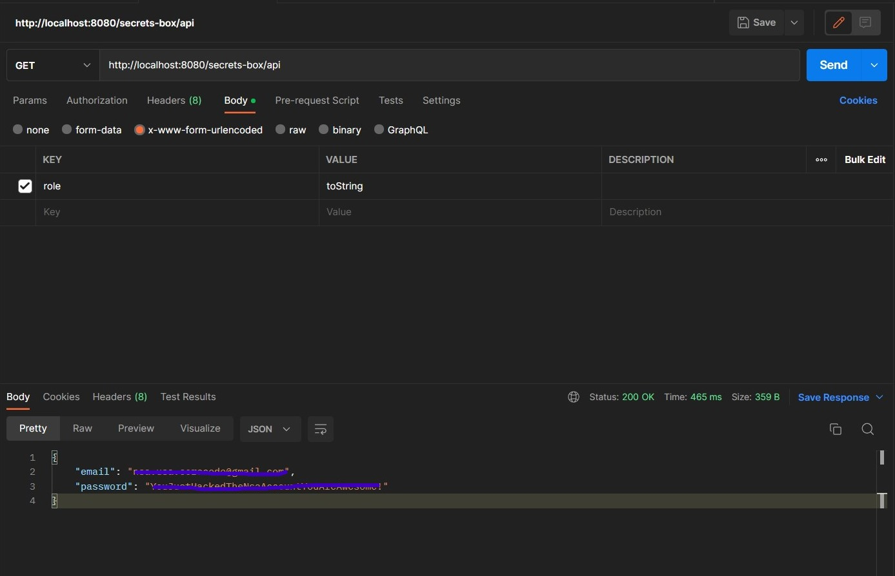
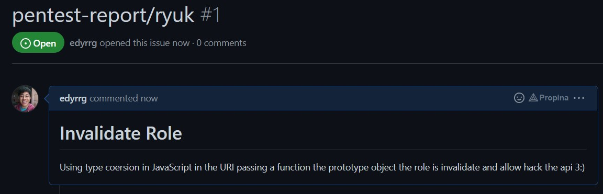

# Wednesday Challenge

## Age Prediction API 👶-👴

Solution

``` JavaScript
const express = require('express'),
    port = 3000,
    app = express(),
    root = "/api/age/"

app.get(root + ':id', (req, res) => {
    const name = req.params.id
    const age = ageRandom()
    const result = {
        name: name,
        age: age,
        days: ageDays(age)
    }
    res.send(result)
})

app.get(root, (req, res) => {
    res.send({ error: `Missing parameter 'name' was expected.` })
})

const ageRandom = () => {
    return Math.floor((Math.random() * 98) + 1)
}

const ageDays = (age) => {
    return Math.floor(age * 365)
}

app.listen(port, () => {
    console.log(`Listening on port: ${port}`)
})
```

[git-project](https://github.com/edyrrg/age-prediction)

## NSA Secrets Box API - Hacking Challenge 👨‍💻

Solution: Para saltarme la comprobación de role en la URI le mande una funcion para cuando validarara el rol por la forma en la que funciona
JavaScript haria un conversion implicita haciendo comportar de manera extraña la comprobacion y asi obteniendo las credenciales.





``` JavaScript
//role-validator.js

//esta validacion con ayuda de la coersion de javascript puede ser saltada.

if (randomNumber < roles[role]) {
    return false;
  } else if (randomNumber > roles[role]) {
    return false;
  } else if (randomNumber === roles[role]) {
    return false;
  }
```

[Regresar](/README.md)
